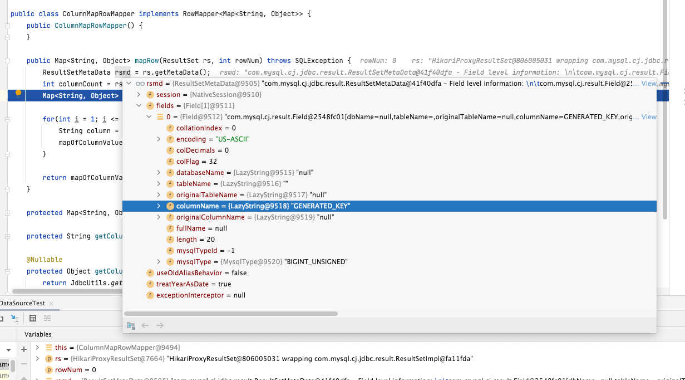

## init database and table

```sql
DROP DATABASE IF EXISTS `test_db`;

CREATE DATABASE `test_db` DEFAULT CHARACTER SET utf8mb4 COLLATE utf8mb4_unicode_ci;

use `test_db`;

DROP TABLE IF EXISTS `t_order`;

CREATE TABLE `t_order`
(
    order_id   INT    NOT NULL AUTO_INCREMENT,
    user_id    INT    NOT NULL,
    address_id BIGINT NOT NULL,
    status     VARCHAR(45) NULL,
    PRIMARY KEY (order_id)
)ENGINE=InnoDB DEFAULT CHARSET=utf8;
```

## run the unit test

`OrderRepositoryImplTest.java`


## ResultSet diff

raw ResultSet default ColumnName is `GENERATED_KEY`


